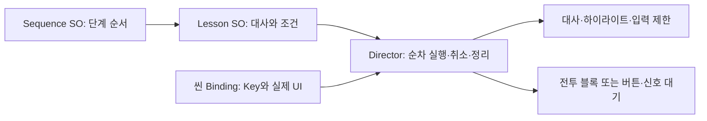

# 튜토리얼 조립 가이드

## 위치

- `Scenes/TutorialScene.unity`: 실제 실행 씬
- `Data/FirstBattleSequence.asset`: **기획자가 조립하는 시퀀스**
- `Data/Steps/`: 재사용 가능한 단계 SO 13개
- `Data/IngameTutorialSettings.asset`: 소환 유닛·칸, 식량, 연출 속도, 손가락 표시 설정
- `Scripts/`: 실행과 표시 코드
- `Editor/`: Inspector, 씬 연결, 플레이 검증 도구

HSD의 기존 가챠 튜토리얼은 별도 시스템으로 유지합니다. `Data/IngameTutorialSequence.asset`는 이전 형식의 이관 원본입니다. 현재 실행은 `FirstBattleSequence`를 사용하므로 이관 원본 대신 `Steps`를 수정하세요.

## 단계 조립

1. Project 창에서 `Create > USW > Tutorial > Lesson`으로 단계 SO를 만듭니다.
2. Kind를 선택하고 대사와 조건을 입력합니다.
3. `FirstBattleSequence`의 Lessons에 SO를 드래그합니다. 목록 순서가 실행 순서입니다. 목록에서 빼면 해당 단계만 제외되고 SO 자체는 남습니다.
4. Inspector의 구성 오류를 해결하고 TutorialScene을 Play 합니다. 실제 입력 완료 전에는 대사나 배경을 눌러 강제 단계를 넘길 수 없습니다.

| Kind | 용도 | 완료 조건 |
|---|---|---|
| GameplayRecipe | 소환, 합성, 보스 연출, 토템 조작 등 기존 전투 블록 | 실제 게임 상태 변화. Gameplay에서 블록과 대사, 시작 지연 편집 |
| Awareness | 하이라이트와 대사를 보여 주는 인지 표시 | 화면 터치. 해당 터치는 아래 UI로 전달되지 않음 |
| ForceButton | 지정한 버튼만 누르게 하는 선택 강제 | 해당 Button의 클릭 이벤트 |
| WaitForSignal | 특정 게임 이벤트까지 대사 유지 | Director.Signal에 지정한 Completion Signal 전달 |

일반 안내 블록은 즉시 시작 / 대상이 보이면 시작 / 신호를 받으면 시작을 선택할 수 있습니다. Delay Seconds는 시작 조건 충족 후의 대기 시간입니다. 신호는 대기 시작 이후의 새 이벤트만 받습니다. 이미 지나간 이벤트를 다시 재생하지 않습니다.

플레이어의 월드 조작으로 발생하는 신호를 기다리려면 Allow World Input도 켜 주세요. 게임 이벤트 대기 중에는 오버레이로 화면을 막지 않습니다. 대기 신호가 실제로 발생하도록 연결해야 하며 자동으로 다음 단계로 건너뛰지는 않습니다.

ForceButton은 **클릭 자체**를 완료로 봅니다. 구매 성공·합성 완료 등 결과 보장이 필요하면 해당 GameplayRecipe를 사용하거나 실제 성공 이벤트에 Signal을 연결하세요. WaitForSignal에서는 게임이 진행되도록 일시정지를 끕니다.

## 씬 대상 연결

SO에는 씬 오브젝트 참조를 넣지 않습니다. 씬 UI에 `TutorialTargetBinding`을 붙이고 고유 Key, Highlight(RectTransform), Button을 지정한 뒤 Director의 Targets 목록에 넣습니다. 단계의 Target Key에 같은 이름을 입력합니다.

기본 Key는 `Summon`, `Upgrade`, `ChiefSkill`, `TotemInventory`입니다. 예를 들어 강화 버튼 안내를 추가하려면 Awareness 단계에 `TargetKey = Upgrade`, 대사를 입력하고 강화 버튼이 공개된 이후 위치에 넣습니다. 새 UI도 바인딩만 추가하면 됩니다.

게임 이벤트는 UnityEvent에서 Director의 `Signal(string)`을 연결하거나 게임 코드가 주입받은 Director에 신호를 전달합니다. 새로운 게임 판정 자체는 프로그래머가 연결해야 합니다. 이 도구가 임의의 게임 로직을 자동 생성하지는 않습니다.

## 전투 블록의 선행 조건

전투 블록은 앞 단계에서 만든 유닛·보스·토템을 사용합니다. 무조건 임의 순서로 바꾸면 실행할 수 없으므로 Sequence Inspector에서 선행 조건과 중복을 검증합니다. 13개라는 개수 제한은 없습니다. 일반 안내 블록은 추가·재사용할 수 있고, 독립적인 단계는 선행 조건을 지켜 재배치할 수 있습니다.

기본 흐름: 첫 소환 → 보스 → 추가 소환 → 합성 → 레벨업 → 강화 열기 → 강화 슬롯 → 족장 → 토템 선택 → 인벤토리 → 배치 → 이동 → 회전.

토템은 바로 드래그하면 이동, 꾹 눌러 게이지가 찬 뒤 드래그하면 회전합니다. 강제 단계에서는 대사가 계속 표시되며 실제 조작이 끝나야 다음 대사로 넘어갑니다. 인지 단계는 화면 터치로 대사와 안내를 닫고 선택은 자유롭게 합니다.

## 유지보수

`Tools > USW > Tutorial > Setup TutorialScene`은 저장된 씬의 연결을 복구하고 누락된 기본 데이터를 만듭니다. 기존 시퀀스의 Lessons 목록과 단계 SO의 편집 내용은 덮어쓰지 않습니다. 처음 만든 씬 배선 도구이므로 커스텀 씬에서는 자동 실행하지 마세요.

`Run Play Checks`는 기본 13단계 구성의 회귀 검증입니다. 기획자가 순서를 바꾼 모든 시퀀스에 적용되는 범용 테스트는 아닙니다. 직접 씬 Play는 매번 처음부터 시작합니다. 계정별 완료 저장과 로비 진입 분기는 아직 포함하지 않습니다.

2026-09-27 구조 재검토 및 Play 검증: 기본 13단계 진행, 잘못된 합성/배치 거부, 배치 취소 후 재시도, 즉시 이동/홀드 회전, 일반 안내 삽입, 선행 조건 누락 검출, 버튼 강제, 새 신호만 수신, 다른 시스템의 일시정지 보존, 취소 정리까지 통과했습니다. 보고서: `outputs/tutorial-qa/checks.txt`. 실제 Android 터치 검증은 별도로 필요합니다.
