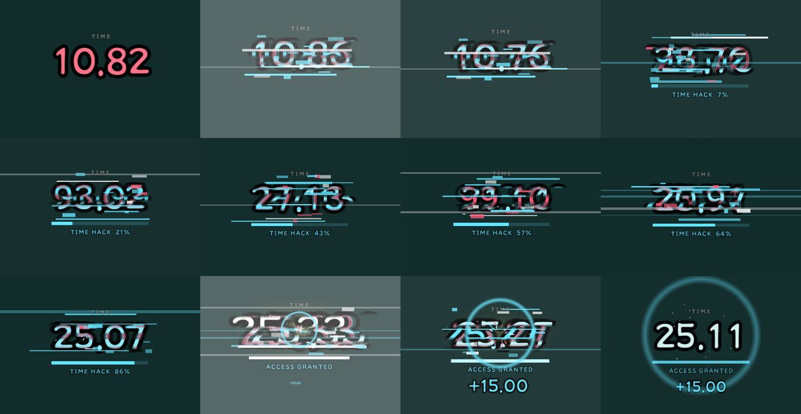
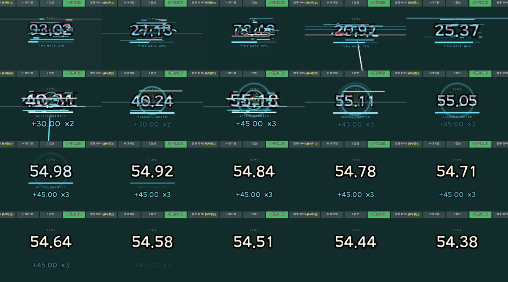
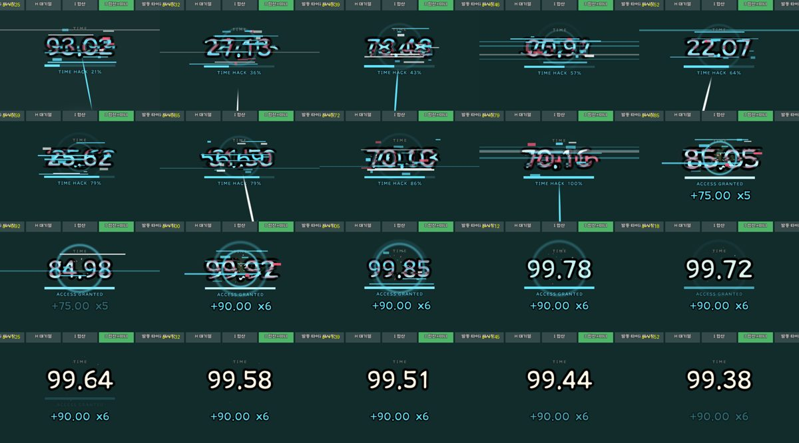
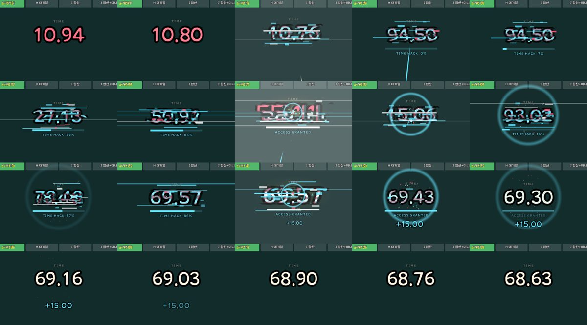

# 타이머 해킹 연출 (글리치) — 연출 문서

> 작성 2026-10-09 · 실험실 `FxLab_TimerBonus` 시안 E·F·G~J
> 상태: **실험실 시안 단계** — 인게임 미연결. 사용자 확인: **E 연출 + J 중첩 규칙**으로 진행.

---

## 1. 개요

드론(캐릭터)이 **타이머를 해킹해서 남은 시간을 올리는** 순간의 연출.
타이머가 홀로그램처럼 가로 띠로 찢어지고 숫자가 마구 뒤섞이다가, 왼쪽 자리부터 새 값으로 "탁탁탁탁" 고정되며
`ACCESS GRANTED` / `+15.00`으로 마무리된다. 처치~정상화 **약 0.5초**.

여러 캐릭터가 연달아 발동해도 화면이 꼬이지 않도록 **중첩 규칙(J)**을 함께 정했다.

**레퍼런스**: `E:/ProjectGaeGGULDefence/design/글리치모드.gif` (저장소 밖 로컬 파일) — 금 간 크리스탈의 홀로그램 글리치.
가져온 요소: 하늘색 가로 스캔라인이 튀는 것 / 행(가로 띠) 단위로 화면이 어긋나는 것 / 색 번짐(RGB 분리).

---

## 2. 시안 목록 (실험실 버튼)

| 버튼 | 내용 | 상태 |
|---|---|---|
| **E 해킹** | 뒤섞임 → 왼쪽부터 고정 | **채택** |
| F 해킹 상승 | 뒤섞는 대신 진행 막대가 찰 때마다 숫자가 덩어리째 올라감 | 비교용 보존 |
| G 재시작 | 발동마다 처음부터 다시 (규칙 없이 붙였을 때) | 비교 기준 |
| H 대기열 | 하나 끝나야 다음 재생 | 탈락 — 연출이 길게 이어지고 표시가 실제보다 늦음 |
| I 합산 | 고정이 **끝나기 전** 발동은 합산, 끝난 뒤 발동은 새 전체 해킹 | 비교용 (이전 규칙) |
| **J 합산+미니** | 고정 **시작 전** 발동은 합산, 그 뒤 발동은 끝나자마자 짧은 버전을 이어 붙이고 결과 숫자 누적 | **채택** |

---

## 3. E 해킹 — 타임라인

모든 시각은 **해킹 시작(발동) 기준 초**. 값은 `TimerBonusLabSettings.asset` → `Hack` (에셋 값이 정본).

| 구간 | 시간 | 화면 |
|---|---|---|
| 감염 | 0 ~ 0.05 | 타이머가 깜빡, 한두 자리만 튐 |
| 해킹 | 0.05 ~ 0.33 | 가로 띠 7개로 찢어짐, 숫자 전부 뒤섞임, 하늘색으로 물듦, RGB 잔상, 스캔라인·픽셀 노이즈, `TIME HACK n%` 막대가 끊기며 참 |
| 고정 | 0.33 ~ 0.465 | 왼쪽 자리부터 0.045초 간격으로 새 값(남은 시간 + 보너스)에 고정. 자리마다 작은 불꽃·박동 |
| 완료 | 0.465 | 히트스톱 + 플래시 + 하늘색 링 + 불꽃, `ACCESS GRANTED`, `+15.00` 튀어나옴 |
| 가라앉음 | ~0.65 | 글리치가 0.18초에 걸쳐 사라짐, 타이머 색 원래대로 |
| 잔진동 | 완료 +0.3 | 0.08초 짧은 글리치 1회 |

- 처음 버전(약 0.94초)을 사용자 요청("조금 더 빨리 — 여러 마리가 하면 겹칠 것")으로 절반으로 줄였다.
- 회전 중에도 실제 시간은 흐르므로, 고정 목표값은 **마지막 자리가 고정되는 순간의 (남은 시간 + 보너스)** — 고정 직후 표시와 끊김 없이 이어진다.

### 글리치 구성 요소

| 요소 | 방법 | 비고 |
|---|---|---|
| 가로 띠 어긋남 | 타이머 숫자 사본을 띠마다 `RectMask2D`로 잘라 좌우로 밀기 (본체는 숨김) | 띠가 안 밀리면 원래 타이머와 똑같이 보임. 띠마다 다른 숫자를 보여 "위아래가 다른 깨진 글자" 연출 |
| 색 번짐 | 하늘색·분홍 잔상 2장을 좌우로 벌림 | 레퍼런스는 하늘색 위주라 분홍 잔상 투명도를 0.55로 낮춤 |
| 스캔라인 | 얇은 하늘색/흰색 가로줄, 일부는 화면을 가로지르는 옅은 찢김선 | |
| 픽셀 노이즈 | 숫자 둘레 작은 사각 조각 | |
| 진행 막대 | `TIME HACK n%` → `ACCESS GRANTED` | 끊기며 차되 **절대 뒤로 가지 않음** |

글리치 무늬는 `TickSeconds`(0.04초)마다 틱 번호 해시로 정한다 — 같은 시각에는 항상 같은 화면(히트스톱·슬로모션에서도 안정).

---

## 4. 중첩 규칙 (J) — 여러 캐릭터가 연달아 발동할 때

**원칙: 실제 시간 보너스는 발동 순간 바로 붙는다. 연출은 표시만 아래 규칙대로 따라간다.**

| 발동 시점 | 처리 |
|---|---|
| 진행 중 해킹의 **고정 시작 전** | 그 해킹에 **합산**: 보너스를 더하고 고정을 0.08초 늦춤(`MergeExtendSeconds`). 합쳐진 순간 진행률에서 이어서 차므로 막대가 뒤로 가지 않음. 타이머에 작은 링 |
| **고정 시작 후 ~ 완료 후 0.6초 안** (`ChainWindowSeconds`) | 지금 해킹은 건드리지 않고 그대로 끝냄 → **끝나자마자 짧은 버전을 이어 붙임**. 여러 개면 0.12초 간격(`ChainGapSeconds`)으로 하나씩 툭툭 |
| 그 이후 | 단독 짧은 버전 |

**짧은 버전(미니)**: 뒤섞임·막대 없이 바로 새 값으로 튀고 0.18초 글리치로 가라앉음. 박동 + 작은 링(히트스톱·플래시 없음).

**결과 글자 누적**: 이어 붙은 짧은 버전은 결과 글자를 덮어쓰지 않고 숫자만 올린다 — `+15.00` → `+30.00 x2` → `+45.00 x3`.
`ACCESS GRANTED`와 막대도 유지되고, 글자는 툭 커졌다 돌아온다.

### 검증한 상황 (실험실 "발동 타이밍" 버튼)

| 묶음 | 발동 시점 (처치 기준 초) | J 결과 |
|---|---|---|
| 몰아서 3 + 늦게 1 | 0 / 0.1 / 0.22 / 0.75 | 앞 3번 합산 `+45 x3` → 4번째 이어 붙어 `+60 x4` |
| 끝날 때쯤 | 0 / 0.4 / 0.52 | 막대 21→86% 단조 증가, 고정된 자리 재뒤섞임 없음, `+30 x2 → +45 x3`, 처치 후 약 0.8초 정리 |
| 연타 6 | 0 ~ 0.75, 0.15초 간격 | 앞 5번 합산 `+75 x5` → 6번째 이어 붙어 `+90 x6`, 약 0.85초 |

### 규칙 없이 붙였을 때(G)의 문제 — 참고

발동마다 해킹이 처음부터 다시 시작돼 계속 끊기고, 총 몇 초가 붙었는지 알 수 없다.
I(이전 규칙)는 고정 중에 합쳐지면 이미 고정된 자리가 다시 뒤섞이고 막대가 뒤로 갔다(71%→64%) — J에서 해결.

---

## 5. 튜닝 값 (`TimerBonusLabSettings.asset` → `Hack`)

| 값 | 현재 | 의미 |
|---|---|---|
| InfectSeconds | 0.05 | 감염 깜빡임 |
| HackSeconds | 0.28 | 뒤섞임 (첫 자리 고정까지) |
| LockStagger | 0.045 | 자리 고정 간격 |
| SettleSeconds | 0.18 | 완료 후 가라앉음 (짧은 버전 길이이기도 함) |
| TickSeconds | 0.04 | 글리치 무늬 바뀌는 간격 |
| SliceCount | 7 | 가로 띠 수 |
| MaxSliceShift | 24 px | 띠 최대 어긋남 |
| RgbOffset | 4 px | 색 번짐 간격 |
| ScanlineCount / NoiseBlockCount | 9 / 12 | 스캔라인·노이즈 최대 수 |
| CyanTint | 0.7 | 해킹 중 하늘색 물듦 |
| AftershockTimes | 0.3 | 잔진동 시점 (완료 기준) |
| MergeExtendSeconds | 0.08 | 합산 시 고정 지연 — 연타가 많으면 해킹이 0.47→0.85초까지 길어짐, 줄이면 짧아짐 |
| ChainWindowSeconds | 0.6 | 결과에 이어 붙는 시간 창 |
| ChainGapSeconds | 0.12 | 이어 붙는 짧은 버전 간격 |
| StackTriggerSets | 3묶음 | 실험실 비교용 발동 시점 |

코드 상수(글자 유지 시간 등)는 `TimerBonusHack.cs` 상단.

---

## 6. 구현 위치

| 파일 | 역할 |
|---|---|
| `Assets/WorkSpace/USW/Scripts/IngameUI/TimerBonusLab/TimerBonusHack.cs` | E/F 연출 본체. 해킹 한 번(`Run`: 시작·이전 보너스·보너스·합산 수·고정 지연·미니·이어 붙음·누적 표시)을 그리는 렌더러 |
| `.../TimerBonusLab/TimerBonusHackStack.cs` | G~J 중첩 규칙 — 발동 시점 목록으로 해킹 목록을 매 프레임 다시 계산(같은 시각엔 같은 화면) |
| `.../TimerBonusLab/TimerBonusLab.cs` | 실험실 드라이버 — `TimerRoot`/`SetTimerDigit`/`SetTimerAlpha`/`SetHack`, 시안 등록, `NextTriggerSet` |
| `.../TimerBonusLab/TimerBonusDigits.cs` | `SetDigit` 추가 |
| `.../TimerBonusLab/TimerBonusLabSettings.cs` + `Data/UI/TimerBonusLab/TimerBonusLabSettings.asset` | `HackTuning` |
| `Scripts/Editor/Fx/TimerBonusFxLabBuilder.cs` | `Tools > USW > Fx > Build Timer Bonus Lab` — 씬 재생성 (E·F 버튼, 세 번째 줄 G~J + "발동 타이밍") |
| `Assets/WorkSpace/USW/Scene/FxLab_TimerBonus.unity` | 실험실 씬 |

**실험실 사용법**: 씬 Play → 위 버튼으로 시안 선택, "발동 타이밍"으로 상황 순환, "속도 1/0.5/0.25"로 슬로모션, "보너스 +초"로 +5/+10/+15/+30.
하단 상태 줄에 시안·발동 묶음·처치 기준 시각 표시.

---

## 7. 인게임 적용 시 주의 (미진행)

- **시간은 발동 즉시 `TimerController`에 반영**, 연출은 표시만. 연출 중 씬 종료·일시정지에도 실제 값이 틀어지지 않게.
- 히트스톱은 실험실 시계만 멈춘다. 인게임은 `Time.timeScale` 직접 쓰기 금지 → `TimeScaleService.Request/Release` (AGENTS.md).
- 현재 Develop의 런타임 바인딩(`TimerBonusLab.Present`)은 **시안 A(합체)만** 지원하고 실제 HUD `TMP_Text` 한 장에 그린다.
  해킹 연출은 실험실 전용 숫자 묶음(`TimerBonusDigits` 띠 사본 12개)에 의존하므로, 인게임 HUD 타이머 구조에 맞춘 이식이 필요하다.
- **성능 미검증**: 띠 사본 12개 × TMP 9장 ≈ 108개 TMP + RectMask2D. Android(30fps, 드로우콜 100 이하)에서 측정 필요 — 띠 수를 줄이거나 셰이더 방식으로 바꾸는 안 검토.
- 중첩 규칙 J의 판단(합산/이어 붙임)은 발동 시각 목록만으로 결정 → 실제 게임 이벤트 큐로 옮기기 쉬움.

## 8. 미결정 / 다음

- 인게임 연결 시점과 트리거(보스 처치 보너스 vs 해킹 선택지 효과) 확정.
- 결과 글자 표기(`x4` 대신 아이콘·한글 등), `TIME HACK` / `ACCESS GRANTED` 문구 현지화.
- Android 실기기 성능·가독성 확인.
